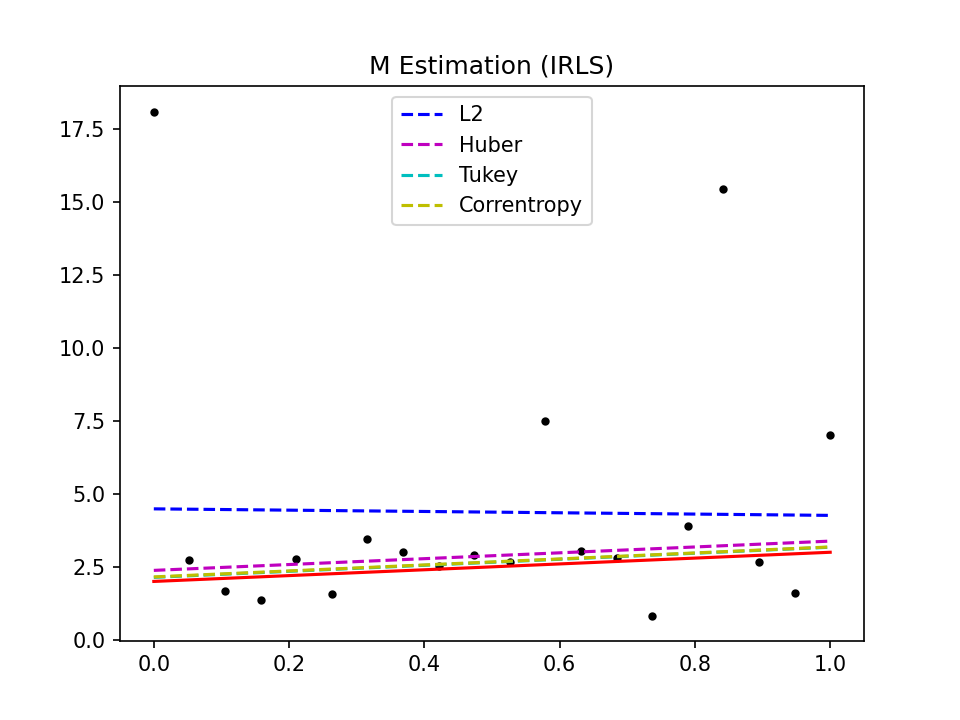
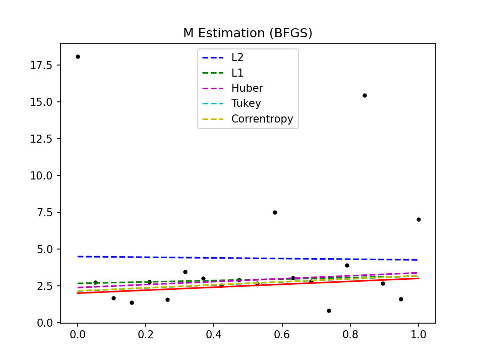
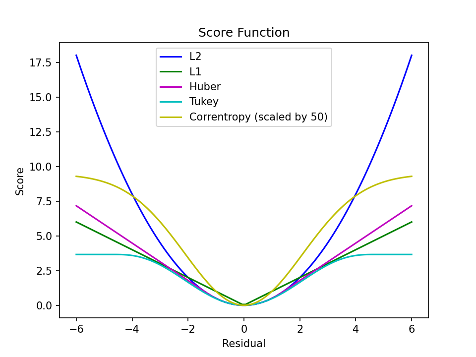
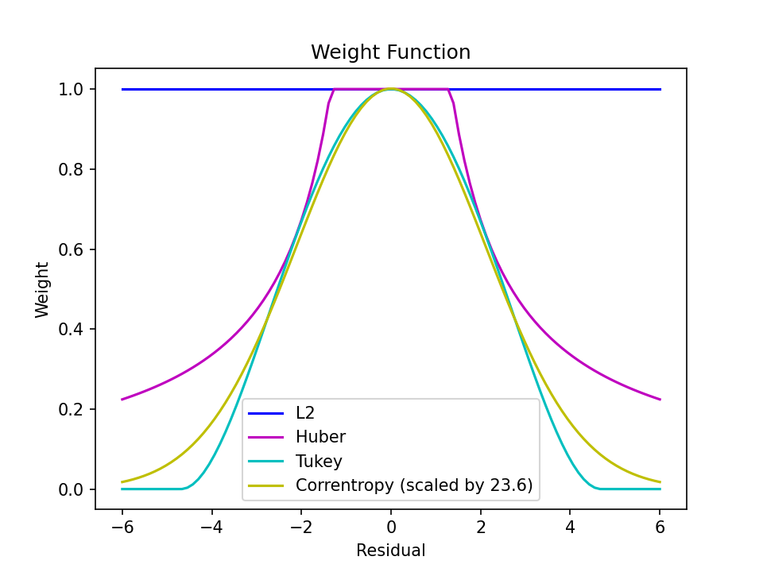

# Robust Regression: A Tutorial

## Introduction

In this project, a robust regression problem is implemented using IRLS (Iteratively Reweighted Least Squares). As a comparison, a direct optimization solution by using BFGS (Broyden–Fletcher–Goldfarb–Shanno) is also provided.

- `m_estimation_bfgs.py`: robust regression with `bfgs` optimizer
- `m_estimation_irls.py`: robust regression with `irls` optimizer
- `score_func.py`: score functions visualization
- `weighted_func.py`: weighted functions visualization

## Problem Formulation

Given a series of data points $\{ x_i,y_i \}$ (including outliers), we want to fit a linear model.
$$
y_i = \mathbf x_i^T \beta + \epsilon
$$
The problem can be solved by using generalized maximum likelihood estimation. All we need to do is define a score function $\rho (\cdot)$, and construct a cost function as follows
$$
J(\beta) = \sum_{i=1}^n \rho(r_i)
$$
where the residual $r_i \triangleq \beta^T \mathbf x_i - y_i$. 

Then, we can solve the problem by using any unconstrained optimization algorithm. However, since the cost function $J(\beta)$ has a specific structure, we can use an elegant approach to solve the optimization problem, e.g., IRLS.

## Method

IRLS is a optimization method for solving specific optimization problems.

By taking the derivative of the cost function,
$$
\frac{\partial J(\beta)}{\partial \beta} = \sum_{i=1}^n \rho'(r_i) \frac{\partial r_i}{\partial \beta}
$$
we define the influence function as $\phi(r) = \rho'(r)$, and set $\frac{\partial J(\mathbf w)}{\partial \mathbf w} = 0$, yielding
$$
\sum_{i=1}^n \phi(r_i) \frac{\partial r_i}{\partial \beta} = 0
$$
Further, defining the weight function as $\psi(r) = \frac{\phi(r)}{r}$, noting $\frac{\partial r_i}{\partial \beta} = \mathbf x_i$, then
$$
\sum_{i=1}^n \psi(r_i) r_i \mathbf x_i = 0
$$
Let $\Psi = \text{diag} [\psi(r_i)]$, noting $r_i = \beta^T\mathbf x_i - y_i$, we can express it in matrix form as
$$
X \Psi (X^T \mathbf w - Y) = 0
$$
where,
$$
\begin{align}
X &= 
\begin{bmatrix}
\mathbf x_1 & \cdots & \mathbf x_n
\end{bmatrix} \\

Y &= 
\begin{bmatrix}
y_1 & \cdots & y_n
\end{bmatrix}^T
\end{align}
$$
This is a weighted least squares problem, however, since the weight matrix $\Psi$ is a function of the coefficient $\beta$, we need to solve it iteratively.

Based on the derivation above, the steps for solving with IRLS are as follows:

> **IRLS Solving Procedure** 
>
> 1. Choose initial $\beta^{(0)}$.
> 2. If not converged at iteration $k$:
>    - Compute $\Psi^{(k)}$.
>    - Update $\beta^{(k+1)} = (X\Psi X^T)^{-1}(X\Psi Y)$.
> 3. Terminate iteration.

## Results

We used two optimization methods to solve the robust regression problem.

1. IRLS: Just provide weight function
2. BFGS: Just provide score function.

BFGS can be replaced by any general unconstrained optimization algorithm, such as CG (conjugate gradient) method.

## Visualization

### Score Functions

### Weights Functions

## Reference

- [Wikipedia: Robust Regression](https://en.wikipedia.org/wiki/Robust_regression)
- [Wikipedia: Iteratively Reweighted Least Squares](https://en.wikipedia.org/wiki/Iteratively_reweighted_least_squares)
