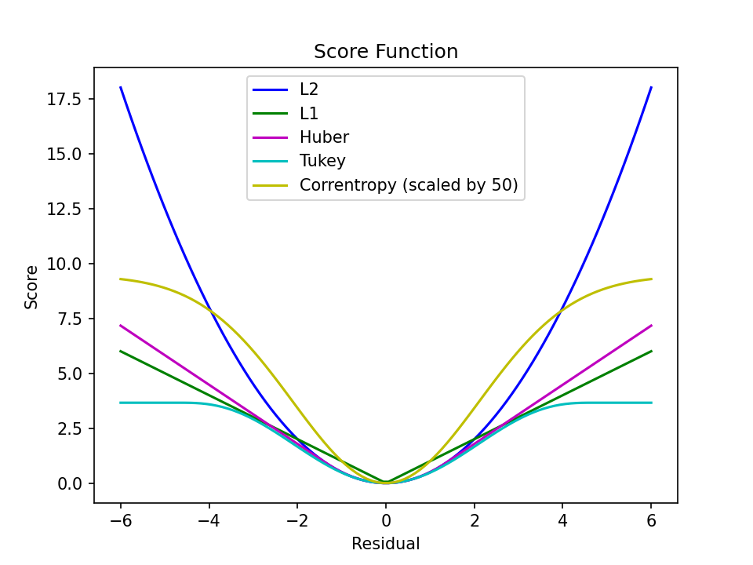
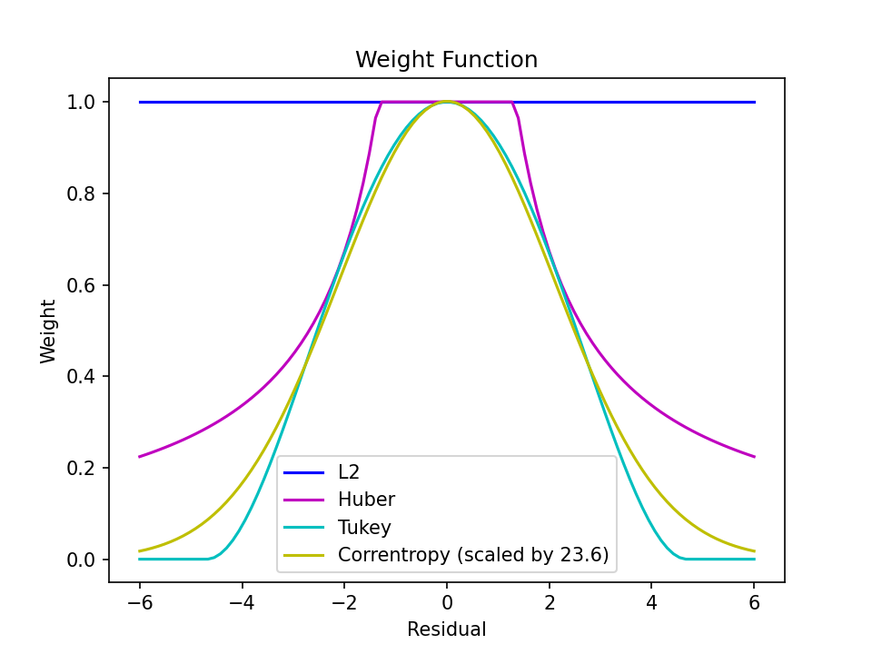

# Robust Regression: A Tutorial

## Introduction

In this project, we implement a robust regression solution employing Iteratively Reweighted Least Squares (IRLS). Additionally, we offer a comparison with a direct optimization approach utilizing the Broyden–Fletcher–Goldfarb–Shanno (BFGS) algorithm.

- `m_estimation_bfgs.py`: robust regression using BFGS optimizer
- `m_estimation_irls.py`: robust regression using BFGS optimizer
- `score_func.py`: score functions visualization
- `weighted_func.py`: weighted functions visualization

## Problem Formulation

Given a series of data points ${ x_i, y_i }$, including potential outliers, our objective is to fit a linear model.

$$y_i = \mathbf x_i^T \beta + \epsilon$$

The problem can be addressed through the utilization of generalized maximum likelihood estimation. This entails defining a score function $\rho (\cdot)$ and subsequently constructing a cost function as follows:

$$J(\beta) = \sum_{i=1}^n \rho(r_i)$$

where the residual $r_i \triangleq \beta^T \mathbf x_i - y_i$. 

Then, the problem can be resolved using any unconstrained optimization algorithm. However, given the distinctive structure of the cost function $J(\beta)$, we can opt for a more elegant solution approach, such as Iteratively Reweighted Least Squares (IRLS).

## Method

IRLS is an optimization method for resolving specific optimization challenges.

By taking the derivative of the cost function,

$$\frac{\partial J(\beta)}{\partial \beta} = \sum_{i=1}^n \rho'(r_i) \frac{\partial r_i}{\partial \beta}$$

we introduce the influence function as $\phi(r) = \rho'(r)$, and set $\frac{\partial J(\mathbf w)}{\partial \mathbf w} = 0$, yielding

$$\sum_{i=1}^n \phi(r_i) \frac{\partial r_i}{\partial \beta} = 0$$

Further, defining the weight function as $\psi(r) = \frac{\phi(r)}{r}$, noting $\frac{\partial r_i}{\partial \beta} = \mathbf x_i$, then

$$\sum_{i=1}^n \psi(r_i) r_i \mathbf x_i = 0$$

Let $\Psi = \text{diag} [\psi(r_i)]$, noting $r_i = \beta^T\mathbf x_i - y_i$, we can express it in matrix form as

$$X \Psi (X^T \mathbf w - Y) = 0$$

where,

$$X =  \begin{bmatrix} \mathbf x_1 & \cdots & \mathbf x_n \end{bmatrix}$$
$$Y =  \begin{bmatrix} y_1 & \cdots & y_n \end{bmatrix}^T$$

This constitutes a weighted least squares problem. However, given that the weight matrix $\Psi$ is a function of the coefficient $\beta$, iterative solutions become necessary.

Derived from the above derivation, the steps for resolving it via IRLS are outlined as follows:

> **IRLS Solving Procedure** 
>
> 1. Choose initial $\beta^{(0)}$.
> 2. If not converged at iteration $k$:
>    - Compute $\Psi^{(k)}$.
>    - Update $\beta^{(k+1)} = (X\Psi X^T)^{-1}(X\Psi Y)$.
> 3. Terminate iteration.

## Results

We used two optimization methods to solve the robust regression problem.

1. IRLS: Only need to provide weight function
2. BFGS: Only need to provide score function.

BFGS can be replaced by any general unconstrained optimization algorithm, such as CG (conjugate gradient) method.

## Visualization

### Score Functions

### Weights Functions

## Reference

- [Wikipedia: Robust Regression](https://en.wikipedia.org/wiki/Robust_regression)
- [Wikipedia: Iteratively Reweighted Least Squares](https://en.wikipedia.org/wiki/Iteratively_reweighted_least_squares)
